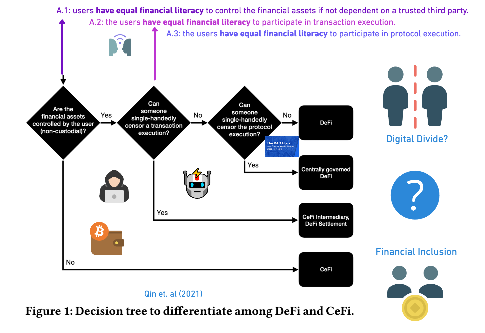
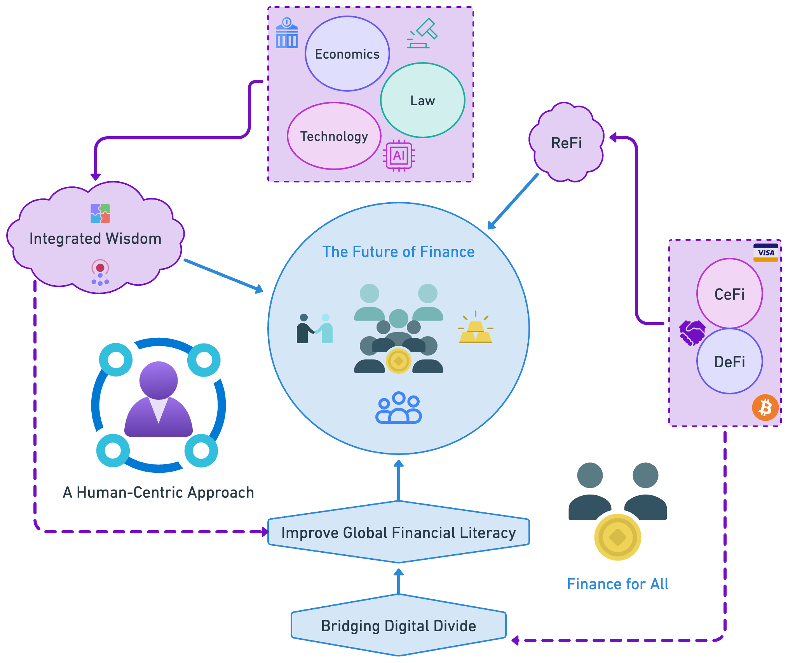
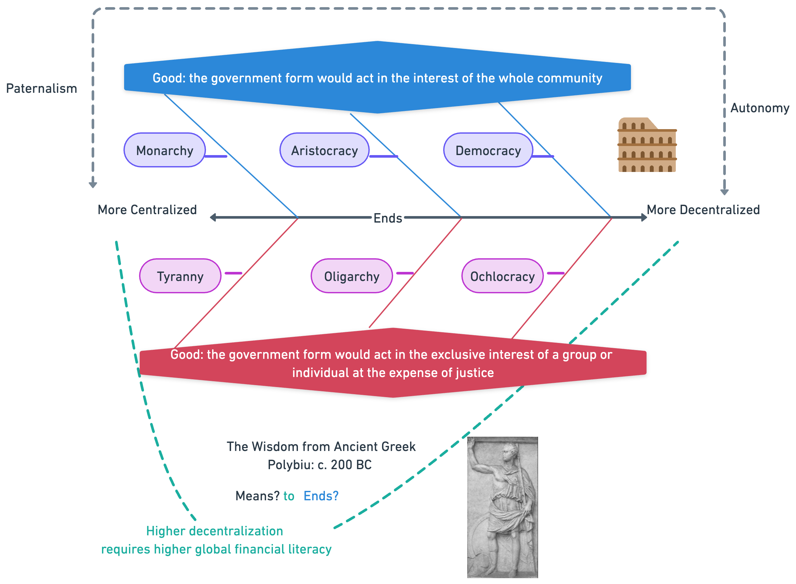

# The Future of Finance: CeFi and DeFi as A Synthetic Solution 

# Illustrations
##

> 

> 

> 

> > 

# Word Cloud Representation

## Title

> 
> 
> This word cloud provides a visual representation of the most frequently occurring words in the titles of the literature in Tables 1 and 2. The size of each word corresponds to its frequency.

## Abstract

>
>
>This word cloud provides a visual representation of the most frequently occurring words in the titles of the literature in Tables 1 and 2. The size of each word corresponds to its frequency.

> 
>
> This figure illustrates the most frequently occurring bigrams (pairs of adjacent words) from the titles of the literature in Tables 1 and 2. The position, color, or size of each bigram may represent its significance or frequency.

> 
>
> This figure illustrates the most frequently occurring bigrams (pairs of adjacent words) from the abstract of the literature in Tables 1 and 2. The position, color, or size of each bigram may represent its significance or frequency.
