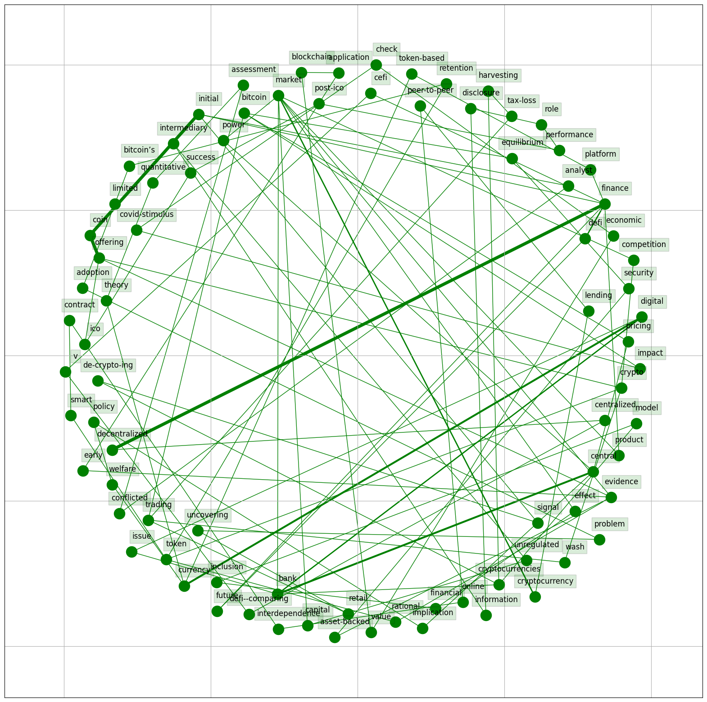
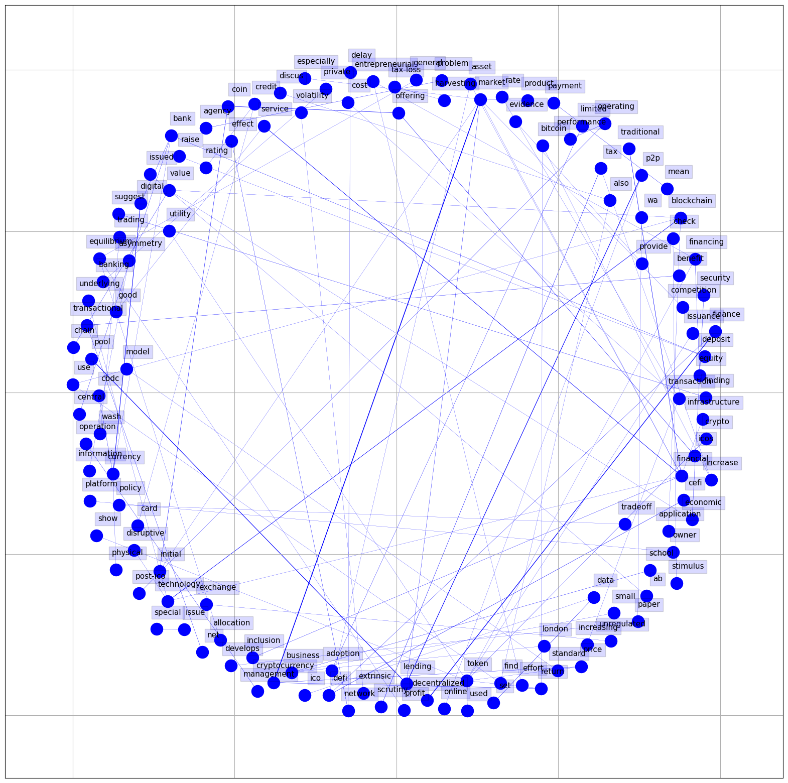

# The Future of Finance: CeFi and DeFi as A Synthetic Solution 

# Word Cloud Representation

> 
> 
> This word cloud provides a visual representation of the most frequently occurring words in the titles of the literature in Tables 1 and 2. The size of each word corresponds to its frequency.

